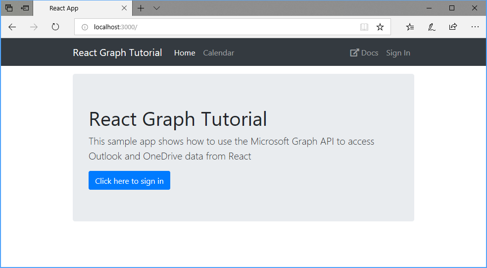

<!-- markdownlint-disable MD002 MD041 -->

Nesta seção, você criará um novo aplicativo reagir.

1. Abra a interface de linha de comando (CLI), navegue até o diretório em que você tem direitos para criar arquivos e execute os seguintes comandos para criar um novo aplicativo de reagir.

    ```Shell
    npx create-react-app@3.4.0 graph-tutorial --template typescript
    ```

1. Quando o comando terminar, mude para o `graph-tutorial` diretório na sua CLI e execute o seguinte comando para iniciar um servidor Web local.

    ```Shell
    npm start
    ```

O navegador padrão é aberto [https://localhost:3000/](https://localhost:3000) com uma página de reagir padrão. Se o navegador não abrir, abra-o e navegue [https://localhost:3000/](https://localhost:3000) até para verificar se o novo aplicativo funciona.

## <a name="add-node-packages"></a>Adicionar pacotes de nós

Antes de prosseguir, instale alguns pacotes adicionais que serão usados posteriormente:

- [reagir-roteador-dom](https://github.com/ReactTraining/react-router) para roteamento declarativo dentro do aplicativo reagir.
- [Bootstrap](https://github.com/twbs/bootstrap) para estilo e componentes comuns.
- [reactstrap](https://github.com/reactstrap/reactstrap) para os componentes de reagir baseados na inicialização.
- [fontawesome-livre](https://github.com/FortAwesome/Font-Awesome) para ícones.
- [tempo](https://github.com/moment/moment) para formatar datas e horas.
- [MSAL](https://github.com/AzureAD/microsoft-authentication-library-for-js) para autenticação no Azure Active Directory e recuperação de tokens de acesso.
- [Microsoft-Graph-Client](https://github.com/microsoftgraph/msgraph-sdk-javascript) para fazer chamadas para o Microsoft Graph.

Execute o seguinte comando em sua CLI.

```Shell
npm install react-router-dom@5.1.2 @types/react-router-dom@5.1.3 bootstrap@4.4.1 reactstrap@8.4.1 @types/reactstrap@8.4.2
npm install @fortawesome/fontawesome-free@5.12.1 moment@2.24.0 msal@1.2.1 @microsoft/microsoft-graph-client@2.0.0 @types/microsoft-graph@1.12.0
```

## <a name="design-the-app"></a>Projetar o aplicativo

Comece criando uma barra de navegação para o aplicativo.

1. Crie um novo arquivo no `./src` diretório chamado `NavBar.tsx` e adicione o código a seguir.

    :::code language="typescript" source="../demo/graph-tutorial/src/NavBar.tsx" id="NavBarSnippet":::

1. Criar uma home page para o aplicativo. Crie um novo arquivo no `./src` diretório chamado `Welcome.tsx` e adicione o código a seguir.

    :::code language="typescript" source="../demo/graph-tutorial/src/Welcome.tsx" id="WelcomeSnippet":::

1. Criar uma mensagem de erro exibida para exibir mensagens para o usuário. Crie um novo arquivo no `./src` diretório chamado `ErrorMessage.tsx` e adicione o código a seguir.

    :::code language="typescript" source="../demo/graph-tutorial/src/ErrorMessage.tsx" id="ErrorMessageSnippet":::

1. Abra o arquivo `./src/index.css` e substitua o conteúdo inteiro pelo seguinte:

    :::code language="css" source="../demo/graph-tutorial/src/index.css":::

1. Abra `./src/App.tsx` e substitua todo o conteúdo pelo seguinte.

    ```typescript
    import React, { Component } from 'react';
    import { BrowserRouter as Router, Route, Redirect } from 'react-router-dom';
    import { Container } from 'reactstrap';
    import NavBar from './NavBar';
    import ErrorMessage from './ErrorMessage';
    import Welcome from './Welcome';
    import 'bootstrap/dist/css/bootstrap.css';

    class App extends Component<any> {
      render() {
        let error = null;
        if (this.props.error) {
          error = <ErrorMessage
            message={this.props.error.message}
            debug={this.props.error.debug} />;
        }

        return (
          <Router>
            <div>
              <NavBar
                isAuthenticated={this.props.isAuthenticated}
                authButtonMethod={this.props.isAuthenticated ? this.props.logout : this.props.login}
                user={this.props.user}/>
              <Container>
                {error}
                <Route exact path="/"
                  render={(props) =>
                    <Welcome {...props}
                      isAuthenticated={this.props.isAuthenticated}
                      user={this.props.user}
                      authButtonMethod={this.props.login} />
                  } />
              </Container>
            </div>
          </Router>
        );
      }
    }

    export default App;
    ```

1. Salve todas as suas alterações e atualize a página. Agora, o aplicativo deve ser muito diferente.

    
