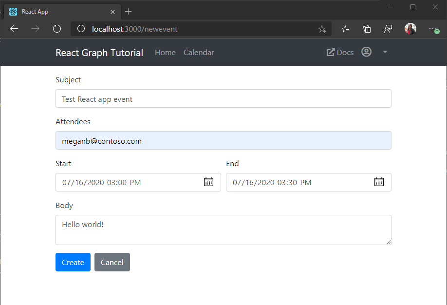

<!-- markdownlint-disable MD002 MD041 -->

<span data-ttu-id="c16d0-101">Nesta seção, você adicionará a capacidade de criar eventos no calendário do usuário.</span><span class="sxs-lookup"><span data-stu-id="c16d0-101">In this section you will add the ability to create events on the user's calendar.</span></span>

## <a name="add-method-to-graphservice"></a><span data-ttu-id="c16d0-102">Adicionar método a GraphService</span><span class="sxs-lookup"><span data-stu-id="c16d0-102">Add method to GraphService</span></span>

1. <span data-ttu-id="c16d0-103">Abra **./src/GraphService.TS** e adicione a função a seguir para criar um novo evento.</span><span class="sxs-lookup"><span data-stu-id="c16d0-103">Open **./src/GraphService.ts** and add the following function to create a new event.</span></span>

    :::code language="typescript" source="../demo/graph-tutorial/src/GraphService.ts" id="createEventSnippet":::

## <a name="create-new-event-form"></a><span data-ttu-id="c16d0-104">Criar novo formulário de eventos</span><span class="sxs-lookup"><span data-stu-id="c16d0-104">Create new event form</span></span>

1. <span data-ttu-id="c16d0-105">Crie um novo arquivo no diretório **./src** chamado **NewEvent. TSX** e adicione o código a seguir.</span><span class="sxs-lookup"><span data-stu-id="c16d0-105">Create a new file in the **./src** directory named **NewEvent.tsx** and add the following code.</span></span>

    :::code language="typescript" source="../demo/graph-tutorial/src/NewEvent.tsx" id="NewEventSnippet":::

1. <span data-ttu-id="c16d0-106">Abra **./src/app.TSX** e adicione a instrução a seguir `import` à parte superior do arquivo.</span><span class="sxs-lookup"><span data-stu-id="c16d0-106">Open **./src/App.tsx** and add the following `import` statement to the top of the file.</span></span>

    ```typescript
    import NewEvent from './NewEvent';
    ```

1. <span data-ttu-id="c16d0-107">Adicione uma nova rota ao novo formulário de evento.</span><span class="sxs-lookup"><span data-stu-id="c16d0-107">Add a new route to the new event form.</span></span> <span data-ttu-id="c16d0-108">Adicione o seguinte código logo após os outros `Route` elementos.</span><span class="sxs-lookup"><span data-stu-id="c16d0-108">Add the following code just after the other `Route` elements.</span></span>

    ```typescript
    <Route exact path="/newevent"
      render={(props) =>
        this.props.isAuthenticated ?
          <NewEvent {...props} /> :
          <Redirect to="/" />
      } />
    ```

    <span data-ttu-id="c16d0-109">Agora, a `return` instrução completa deve ter a seguinte aparência.</span><span class="sxs-lookup"><span data-stu-id="c16d0-109">The full `return` statement should now look like this.</span></span>

    :::code language="typescript" source="../demo/graph-tutorial/src/App.tsx" id="renderSnippet" highlight="23-28":::

1. <span data-ttu-id="c16d0-110">Atualize o aplicativo e navegue até o modo de exibição calendário.</span><span class="sxs-lookup"><span data-stu-id="c16d0-110">Refresh the app and browse to the calendar view.</span></span> <span data-ttu-id="c16d0-111">Clique no botão **novo evento** .</span><span class="sxs-lookup"><span data-stu-id="c16d0-111">Click the **New event** button.</span></span> <span data-ttu-id="c16d0-112">Preencha os campos e clique em **criar**.</span><span class="sxs-lookup"><span data-stu-id="c16d0-112">Fill in the fields and click **Create**.</span></span>

    
